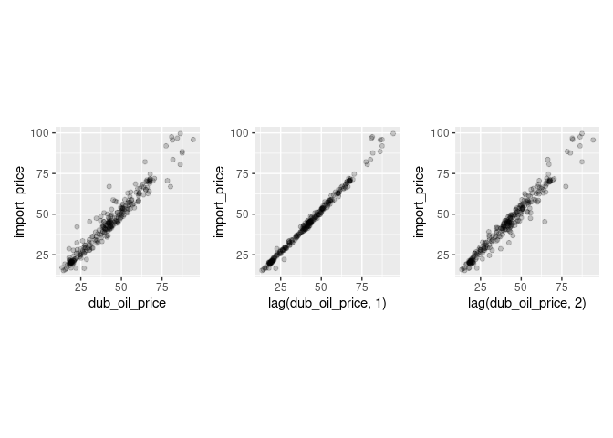
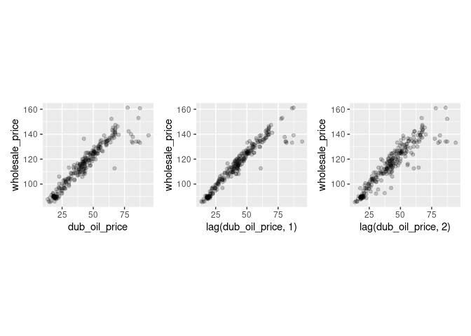
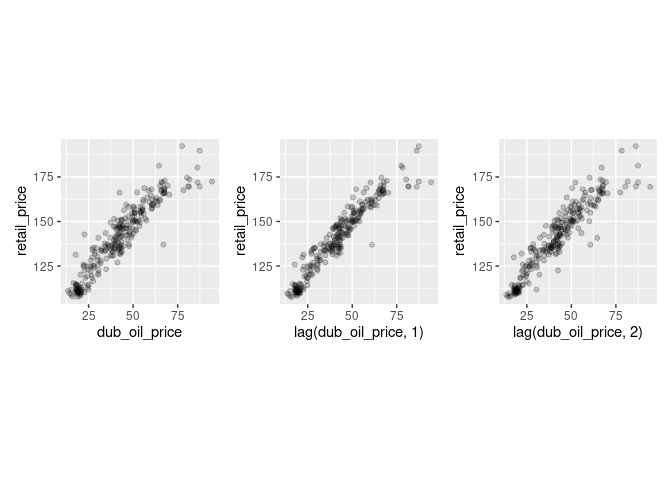
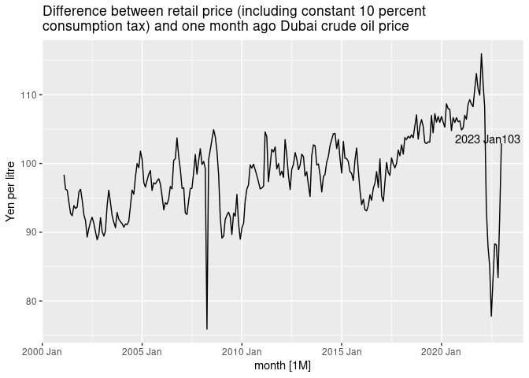

Gasoline prices in Japan
================
Mitsuo Shiota
2021-11-17

-   [Summary](#summary)
-   [Get gasoline prices](#get-gasoline-prices)
-   [Plot retail, wholesale gas and crude oil
    prices](#plot-retail-wholesale-gas-and-crude-oil-prices)
-   [Plot price differences](#plot-price-differences)
-   [Dubai crude oil price (monthly)](#dubai-crude-oil-price-monthly)
    -   [vs Japan customs import price](#vs-japan-customs-import-price)
    -   [vs wholesale gasoline price](#vs-wholesale-gasoline-price)
    -   [vs retail gasoline price](#vs-retail-gasoline-price)
-   [Dubai crude oil price (weekly)](#dubai-crude-oil-price-weekly)
-   [Minor change of METI’s effects calculation from March 14,
    2022](#minor-change-of-metis-effects-calculation-from-march-14-2022)
-   [Wholesalers reported record profits for FY
    2021](#wholesalers-reported-record-profits-for-fy-2021)

Updated: 2022-06-10

## Summary

[Nikkei
reported](https://www.nikkei.com/article/DGXZQOUA169350W1A111C2000000/)
on November 17, 2021 that Ministry of Economy, Trade and Industry (METI)
is considering a subsidy to gasoline wholesalers to suppress gasoline
retail prices when they rise to higher than 170 yen per litre. At the
end of the article, Nikkei showed a skeptical view saying, “As the
number of retailers has decreased, the retailers may not reduce retail
prices even if wholesale prices fall.” So I study the relationship among
retail and wholesale prices of gasoline and imported crude oil prices in
Japan.

I find the current surge in retail prices of gasoline is mainly due to
the surge in imported crude oil prices, and partly due to the reduced
competition among retailers and wholesalers, who are getting more
margins.

To give a subsidy to wholesalers may incentivize them to raise their
margins even more. This subsidy idea is contrary to that of the Biden
Administration, which has begun to investigate oil companies.

## Get gasoline prices

Agency for National Resources Energy under METI publishes gasoline
prices in its [web
site](https://www.enecho.meti.go.jp/statistics/petroleum_and_lpgas/pl007/results.html#headline1).
Although the original retail price data include consumption tax since
April 1, 2004, I exclude consumption tax all over the period.

I get imported crude oil price data from customs statistics via
[e-Stat](https://www.e-stat.go.jp/stat-search/files?page=1&layout=datalist&toukei=00350300&bunya_l=16&tstat=000001013141&cycle=1&tclass1=000001013192&tclass2=000001013194&tclass3val=0).

## Plot retail, wholesale gas and crude oil prices

Yes, both retail and wholesale prices are rising, mainly due to rising
imported crude oil prices.

<!-- -->

<!-- -->

Correlations are 0.9709 if wholesales lead Japan customs by 1 month,
0.9788 if wholesales is concurrent with Japan customs, and 0.9464 if
wholesales lag Japan customs by 1 month. The highest correlation is if
wholesales is concurrent with Japan customs.

## Plot price differences

Differences between retail and wholesale prices have been increasing
since 2016. The average difference was 12 yen per litre from 2000 Jul to
2015 Dec, and is 20 in 2022 Apr. This may reflect the reduced
competition among retailers. You can see the number of retailers has
constantly decreased since around 1995 in the last page of [this
material
(Japanese)](https://www.enecho.meti.go.jp/category/resources_and_fuel/distribution/hinnkakuhou/data/2021_07_30_01.pdf)
from Agency for National Resources Energy.

<!-- -->

Differences between wholesale price and imported crude oil price plus
gasoline tax have also been increasing. The average difference was 16
yen per litre from 2001 Jan to 2014 Dec, and is 23 in 2022 Jan. This may
reflect the reduced competition among wholesalers, who have got
monopolistic power by consolidation.

<!-- -->

It was 22 in 2022 Feb, and failed to drop as much as 5 yen per litre
subsidy. It was 19 in 2022 Mar, and failed to drop significantly,
despite 20-25 yen per litre subsidy given to wholesalers in March. It
was 1 in 2022 Apr, and failed to drop by as much as 20-35 yen per litre
subsidy given to wholesalers in April.

    ## # A tsibble: 5 x 2 [1M]
    ##      month  value
    ##      <mth>  <dbl>
    ## 1 2021 Dec 16.3  
    ## 2 2022 Jan 23.0  
    ## 3 2022 Feb 22.2  
    ## 4 2022 Mar 19.3  
    ## 5 2022 Apr  0.754

## Dubai crude oil price (monthly)

### vs Japan customs import price

Import prices pretty precisely follow Dubai crude oil spot prices of one
month ago.

<!-- -->

Correlations are 0.9674 if 0 month lag from Dubai to Japan customs,
0.9974 if 1 month lag, and 0.9744 if 2 months lag. The highest
correlation is if Japan customs lag Dubai by 1 month.

### vs wholesale gasoline price

<!-- -->

Wholesale prices follow Dubai crude oil prices of one month ago.
Correlations are 0.97 if 0 month lag from Dubai to wholesalers, 0.9822
if 1 month lag, and 0.9481 if 2 months lag. The highest correlation is
if wholesales lag Dubai by 1 month.

### vs retail gasoline price

<!-- -->

Retail prices (including constant 10 percent consumption tax) also
follow Dubai crude oil prices of one month ago. Correlations are 0.9393
if 0 month lag from Dubai to Japan customs, 0.9642 if 1 month lag, and
0.9406 if 2 months lag. The highest correlation is if retails lag Dubai
by 1 month.

<!-- -->

The most recent difference between retail price (including constant 10
percent\\nconsumption tax) and one month ago Dubai crude oil price is
110.99 at 2021 Nov

## Dubai crude oil price (weekly)

I get daily data from
[oilprice.com](https://oilprice.com/jp/%E5%8E%9F%E6%B2%B9%E4%BE%A1%E6%A0%BC%E3%83%81%E3%83%A3%E3%83%BC%E3%83%88).

[METI publishes](https://nenryo-gekihenkanwa.jp/pdf/result_rev8.pdf)
Dubai crude oil prices, counterfactual gasoline prices without
subsidies, actual gasoline prieces and effects of subsidies, which are
differences between counterfacual and actual, all in the units of yen /
litre every week.

Weekly prices are not so different between oilprice.com and METI.

<!-- -->

So I create weekly prices data by combining oilprice.com in 2021 and
METI in 2022.

METI calculates subsidy effects on retail prices by assuming that retail
prices will reflect subsidies 2 weeks later. I have no reason to
disagree.

METI also assumes that there is 2 weeks lag between Dubai crude oil
prices and retail prices (0 week from Dubai to wholesalers and 2 weeks
from wholesalers to retailers). I disagree. In the physical terms, it is
impossible to carry oil from Dubai to retailers in Japan in 2 weeks. In
the accounting terms, all major wholesalers evaluate stocks by average
method, not by LIFO (Last In First Out). In the past observations from
the monthly data, wholesale prices usually lag Dubai crude oil prices by
1 month.

If we assume 3 weeks lag instead, subsidy effects are smaller. When
effects are smaller than subsidies, subsidies are not fully reflected in
retail prices, and wholesalers and/or retailers are getting benefits
from subsidies.

<!-- -->

<!-- -->

Above calculation assumes there is a constant margin between Dubai crude
oil prices and retail prices. Lag 0 to 5 assumes margins 107.3, 107.6,
110.8, 112.4, 118.5, 118.5 respectively.

Lag 2 assumes 110.8, and it is close to the most recent monthly margin
110.99 at 2021 Nov. Let us assume this margin of 110.8 over all lags
between Dubai crude oil prices and retail prices.

<!-- -->

<!-- -->

As I assume fixed margin based on lag 2 assumption, lag 2 does not
change from the previous plots. In lags 3 to 5, there are less effects
of subsidies than the previous plots.

From this analysis, it is clear that the assumption on lag and normal
margin between Dubai crude oil prices and retail gasoline prices is very
important to calculate the effects by subsidies. METI assumes lag of 2
weeks from Dubai to retailers (0 week from Dubai to wholesalers and 2
weeks from wholesalers to retailers), and normal margin 110.8 yen per
litre between Dubai and retail prices. However, the monthly data
analysis in the previous chapter suggests that there usually is one
month lag from Dubai to retailers, and that 110.8 yen per litre gap
between Dubai and retail prices is historically large. I hope I will
find out whether METI’s assumption is reasonable or not, while I update
this page.

## Minor change of METI’s effects calculation from March 14, 2022

METI changed calculation method from March 14, 2022. The new method is:

1.  Reset the last week counterfactual retail price without subsidy to
    the last week actual retail price plus subsidy.

2.  Add Dubai crude oil price change from the last week to this week to
    it, and you will get this week counterfactual retail price without
    subsidy.

I once thought this is a minor change, as METI basically continues to
assume that retail prices will reflect subsidies 2 weeks later, and that
there is 2 weeks lag between Dubai crude oil prices and retail prices.
No, this is not a minor change. The new method makes effects closer to
subsidies inherently.

<!-- -->

## Wholesalers reported record profits for FY 2021

I tweeted about this
[here](https://twitter.com/mitsuoxv/status/1519833594046283781).

EOL
