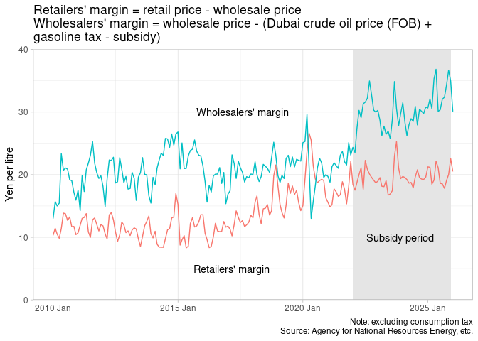

Gasoline retailers’ and wholesalers’ margins in Japan
================
Mitsuo Shiota
2026-03-03

- [Get data](#get-data)
  - [Gasoline wholesale and retail
    prices](#gasoline-wholesale-and-retail-prices)
  - [Dubai crude oil price (monthly)](#dubai-crude-oil-price-monthly)
  - [Subsidy](#subsidy)
  - [Combine](#combine)
- [Plot](#plot)

Updated: 2026-03-04

## Get data

### Gasoline wholesale and retail prices

Agency for National Resources Energy under METI publishes gasoline
prices in its [web
site](https://www.enecho.meti.go.jp/statistics/petroleum_and_lpgas/pl007/results.html#headline1).

Published wholesale prices are monthly, and do not include consumption
tax. Published retail prices are weekly, and include consumption tax. I
transform published retail prices into monthly retail prices which do
not include consumption tax.

### Dubai crude oil price (monthly)

I get monthly Dubai crude oil prices in USD / barrel and exchange rates
in JPY / USD from [FRED by St. Louis FRB](https://fred.stlouisfed.org/),
and transform them into JPY / litre using 1 barrel = 158.987 litre.

### Subsidy

### Combine

## Plot

<!-- -->

END
