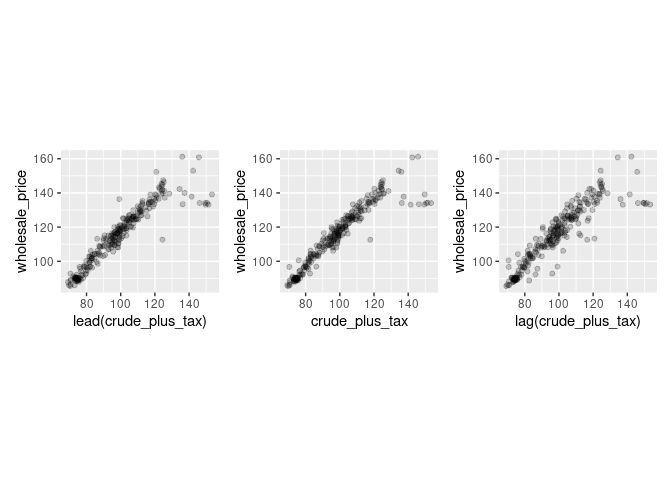
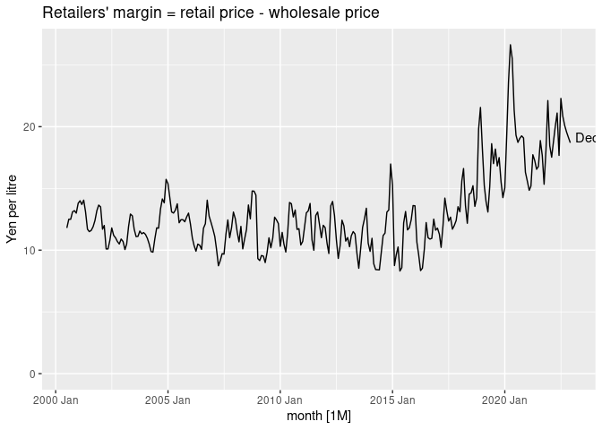
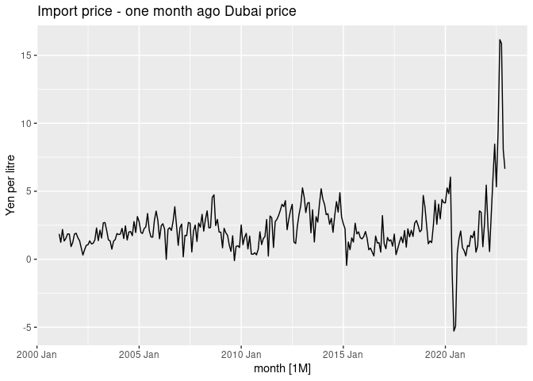
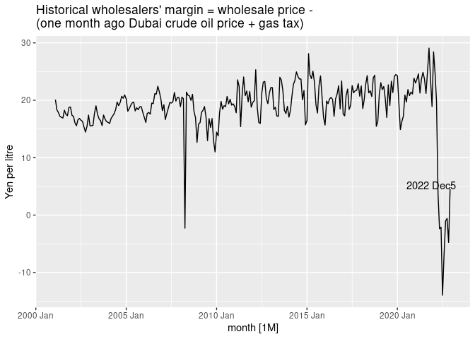
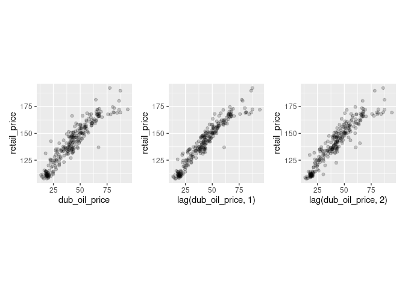
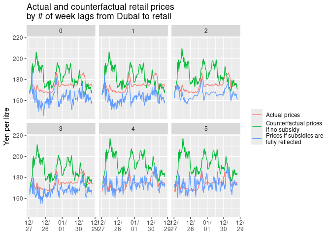
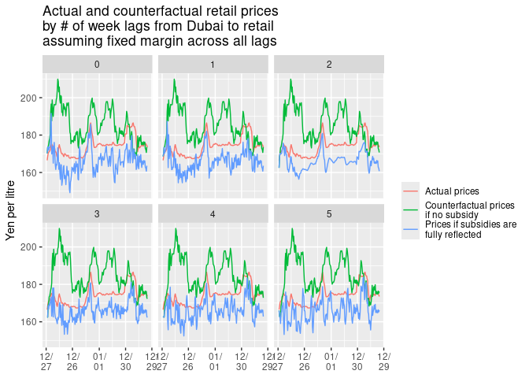

Gasoline prices in Japan
================
Mitsuo Shiota
2021-11-17

-   <a href="#summary" id="toc-summary">Summary</a>
-   <a href="#get-gasoline-prices" id="toc-get-gasoline-prices">Get gasoline
    prices</a>
-   <a href="#plot-retail-wholesale-gas-and-crude-oil-prices"
    id="toc-plot-retail-wholesale-gas-and-crude-oil-prices">Plot retail,
    wholesale gas and crude oil prices</a>
-   <a href="#plot-price-differences" id="toc-plot-price-differences">Plot
    price differences</a>
-   <a href="#dubai-crude-oil-price-monthly"
    id="toc-dubai-crude-oil-price-monthly">Dubai crude oil price
    (monthly)</a>
    -   <a href="#vs-japan-customs-import-price"
        id="toc-vs-japan-customs-import-price">vs Japan customs import price</a>
    -   <a href="#vs-wholesale-gasoline-price"
        id="toc-vs-wholesale-gasoline-price">vs wholesale gasoline price</a>
    -   <a href="#vs-retail-gasoline-price" id="toc-vs-retail-gasoline-price">vs
        retail gasoline price</a>
-   <a href="#dubai-crude-oil-price-weekly"
    id="toc-dubai-crude-oil-price-weekly">Dubai crude oil price (weekly)</a>
-   <a href="#change-of-metis-effects-calculation-from-march-14-2022"
    id="toc-change-of-metis-effects-calculation-from-march-14-2022">Change
    of METI’s effects calculation from March 14, 2022</a>
-   <a href="#wholesalers-reported-record-profits-for-fy-2021"
    id="toc-wholesalers-reported-record-profits-for-fy-2021">Wholesalers
    reported record profits for FY 2021</a>
-   <a
    href="#do-wholesalers-hand-over-subsidy-fully-to-retailers-as-meti-expected"
    id="toc-do-wholesalers-hand-over-subsidy-fully-to-retailers-as-meti-expected">Do
    wholesalers hand over subsidy fully to retailers as METI expected?</a>

Updated: 2022-07-27

## Summary

[Nikkei
reported](https://www.nikkei.com/article/DGXZQOUA169350W1A111C2000000/)
on November 17, 2021 that Ministry of Economy, Trade and Industry (METI)
is considering a subsidy to gasoline wholesalers to suppress gasoline
retail prices when they rise to higher than 170 yen per litre. At the
end of the article, Nikkei showed a skeptical view saying, “As the
number of retailers has decreased, the retailers may not reduce retail
prices even if wholesale prices fall.” So I study the relationship among
retail and wholesale prices of gasoline and imported crude oil prices in
Japan.

I find the current surge in retail prices of gasoline is mainly due to
the surge in imported crude oil prices, and partly due to the reduced
competition among retailers and wholesalers, who are getting more
margins.

To give a subsidy to wholesalers may incentivize them to raise their
margins even more. This subsidy idea is contrary to that of the Biden
Administration, which has begun to investigate oil companies.

## Get gasoline prices

Agency for National Resources Energy under METI publishes gasoline
prices in its [web
site](https://www.enecho.meti.go.jp/statistics/petroleum_and_lpgas/pl007/results.html#headline1).
Although the original retail price data include consumption tax since
April 1, 2004, I exclude consumption tax all over the period.

I get imported crude oil price data from customs statistics via
[e-Stat](https://www.e-stat.go.jp/stat-search/files?page=1&layout=datalist&toukei=00350300&bunya_l=16&tstat=000001013141&cycle=1&tclass1=000001013192&tclass2=000001013194&tclass3val=0).

## Plot retail, wholesale gas and crude oil prices

Yes, both retail and wholesale prices are rising, mainly due to rising
imported crude oil prices.

<!-- -->

<!-- -->

Correlations are 0.9681 if wholesales lead Japan customs by 1 month,
0.9743 if wholesales is concurrent with Japan customs, and 0.9435 if
wholesales lag Japan customs by 1 month. The highest correlation is if
wholesales is concurrent with Japan customs.

## Plot price differences

Differences between retail and wholesale prices have been increasing
since 2016. The average difference was 12 yen per litre from 2000 Jul to
2015 Dec, and is 21 in 2022 May. This may reflect the reduced
competition among retailers. You can see the number of retailers has
constantly decreased since around 1995 in the last page of [this
material
(Japanese)](https://www.enecho.meti.go.jp/category/resources_and_fuel/distribution/hinnkakuhou/data/2021_07_30_01.pdf)
from Agency for National Resources Energy.

<!-- -->

| Month    | Excess over 2021 average |
|:---------|-------------------------:|
| 2022 Feb |                      0.4 |
| 2022 Mar |                      1.6 |
| 2022 Apr |                      2.8 |
| 2022 May |                      3.9 |

Retailers’ excess margin (yen / liter)

The average retailers’ margin in 2021 was 17.2. If I subtract it from
retailers’ margin, I get excess margin above.

Differences between wholesale price and imported crude oil price plus
gasoline tax have also been increasing. The average difference was 16
yen per litre from 2001 Jan to 2014 Dec, and is 23 in 2022 Jan. This may
reflect the reduced competition among wholesalers, who have got
monopolistic power by consolidation. The decrease from 2022 Feb is due
to subsidy.

<!-- -->

## Dubai crude oil price (monthly)

### vs Japan customs import price

Import prices pretty precisely follow Dubai crude oil spot prices of one
month ago.

<!-- -->

Correlations are 0.9674 if 0 month lag from Dubai to Japan customs,
0.9974 if 1 month lag, and 0.9744 if 2 months lag. The highest
correlation is if Japan customs lag Dubai by 1 month.

<!-- -->

Import price is higer than Dubai price by 2.08 yen per litre on average,
probably due to CIF costs.

### vs wholesale gasoline price

<!-- -->

Wholesale prices follow Dubai crude oil prices of one month ago.
Correlations are 0.97 if 0 month lag from Dubai to wholesalers, 0.9822
if 1 month lag, and 0.9481 if 2 months lag. The highest correlation is
if wholesales lag Dubai by 1 month.

<!-- -->

### vs retail gasoline price

<!-- -->

Retail prices (including constant 10 percent consumption tax) also
follow Dubai crude oil prices of one month ago. Correlations are 0.9393
if 0 month lag from Dubai to Japan customs, 0.9642 if 1 month lag, and
0.9406 if 2 months lag. The highest correlation is if retails lag Dubai
by 1 month.

<!-- -->

The most recent difference between retail price (including constant 10
percent\nconsumption tax) and one month ago Dubai crude oil price is
110.99 at 2021 Nov

## Dubai crude oil price (weekly)

I get daily data from
[oilprice.com](https://oilprice.com/jp/%E5%8E%9F%E6%B2%B9%E4%BE%A1%E6%A0%BC%E3%83%81%E3%83%A3%E3%83%BC%E3%83%88).

[METI publishes](https://nenryo-gekihenkanwa.jp/pdf/result_rev8.pdf)
Dubai crude oil prices, counterfactual gasoline prices without
subsidies, actual gasoline prieces and effects of subsidies, which are
differences between counterfacual and actual, all in the units of yen /
litre every week.

Weekly prices are not so different between oilprice.com and METI.

<!-- -->

So I create weekly prices data by combining oilprice.com in 2021 and
METI in 2022.

METI calculates subsidy effects on retail prices by assuming that retail
prices will reflect subsidies 2 weeks later. I have no reason to
disagree.

METI also assumes that there is 2 weeks lag between Dubai crude oil
prices and retail prices (0 week from Dubai to wholesalers and 2 weeks
from wholesalers to retailers). I disagree. In the physical terms, it is
impossible to carry oil from Dubai to retailers in Japan in 2 weeks. In
the accounting terms, all major wholesalers evaluate stocks by average
method, not by LIFO (Last In First Out). In the past observations from
the monthly data, wholesale prices usually lag Dubai crude oil prices by
1 month.

If we assume 3 weeks lag instead, subsidy effects are smaller. When
effects are smaller than subsidies, subsidies are not fully reflected in
retail prices, and wholesalers and/or retailers are getting benefits
from subsidies.

<!-- -->

<!-- -->

Above calculation assumes there is a constant margin between Dubai crude
oil prices and retail prices. Lag 0 to 5 assumes margins 107.3, 107.6,
110.8, 112.4, 118.5, 118.5 respectively.

Lag 2 assumes 110.8, and it is close to the most recent monthly margin
110.99 at 2021 Nov. Let us assume this margin of 110.8 over all lags
between Dubai crude oil prices and retail prices.

<!-- -->

<!-- -->

As I assume fixed margin based on lag 2 assumption, lag 2 does not
change from the previous plots. In lags 3 to 5, there are less effects
of subsidies than the previous plots.

From this analysis, it is clear that the assumption on lag and normal
margin between Dubai crude oil prices and retail gasoline prices is very
important to calculate the effects by subsidies. METI assumes lag of 2
weeks from Dubai to retailers (0 week from Dubai to wholesalers and 2
weeks from wholesalers to retailers), and normal margin 110.8 yen per
litre between Dubai and retail prices. However, the monthly data
analysis in the previous chapter suggests that there usually is one
month lag from Dubai to retailers, and that 110.8 yen per litre gap
between Dubai and retail prices is historically large. I hope I will
find out whether METI’s assumption is reasonable or not, while I update
this page.

## Change of METI’s effects calculation from March 14, 2022

METI changed calculation method from March 14, 2022. The new method is:

1.  Reset the last week counterfactual retail price without subsidy to
    the last week actual retail price plus subsidy.

2.  Add Dubai crude oil price change from the last week to this week to
    it, and you will get this week counterfactual retail price without
    subsidy.

I once thought this is a minor change, as METI basically continues to
assume that retail prices will reflect subsidies 2 weeks later, and that
there is 2 weeks lag between Dubai crude oil prices and retail prices.
No, this is not a minor change. The new method makes effects closer to
subsidies inherently, and allows wholesalers and/or retailers to take as
much money as they like.

I tweet about this [here
(English)](https://twitter.com/mitsuoxv/status/1536998279916924929?s=20&t=arc-0ZS59Qpugt1CcXDGVA)
and [here
(Japanese)](https://twitter.com/mitsuoxv/status/1537004102697136128?s=20&t=arc-0ZS59Qpugt1CcXDGVA).

<!-- -->

## Wholesalers reported record profits for FY 2021

I tweeted about this
[here](https://twitter.com/mitsuoxv/status/1519833594046283781).

## Do wholesalers hand over subsidy fully to retailers as METI expected?

Although I disagree to the METI assumptions, first, I assume them to
check whether wholesalers are acting as METI expected. So I assume that
Dubai crude oil price and subsidy will be reflected to wholesale gas
price 10 days (2 weeks) later, and that the usual margin of wholesalers
is the same as that of 2022 Jan, which is higher than average but within
the historical range. Then, I calculate how much the actual wholesale
gas price exceeds the expected price if subsidy is fully reflected. From
2022 Jan to 2022 Apr, the excesses are small.

| Month    | Actual | Dubai crude | Subsidy | Gas tax | Usual margin | Expected | Excess |
|:---------|-------:|------------:|--------:|--------:|-------------:|---------:|-------:|
| 2022 Jan |  134.4 |        56.9 |     0.0 |    53.8 |         23.7 |    134.4 |    0.0 |
| 2022 Feb |  138.7 |        65.2 |     4.7 |    53.8 |         23.7 |    138.0 |    0.7 |
| 2022 Mar |  140.0 |        78.5 |    16.6 |    53.8 |         23.7 |    139.4 |    0.6 |
| 2022 Apr |  137.8 |        83.1 |    22.8 |    53.8 |         23.7 |    137.8 |    0.0 |
| 2022 May |  133.1 |        86.0 |    34.9 |    53.8 |         23.7 |    128.6 |    4.5 |

Wholesale gas price (yen / liter): 2 weeks lag of subsidy, and 2 weeks
lag of Dubai

Next, I change the assumption on lag of Dubai price from 10 days (2
weeks) based on LIFO to one month (5 weeks) based on the average method
of inventory evaluation actually adopted by wholesalers. In Feb and Mar,
when Dubai price was rising, excesses were large enough to show most
subsidy was taken by wholesalers. In Apr, when Dubai in plateau, excess
was small.

| Month    | Actual | Dubai crude | Subsidy | Gas tax | Usual margin | Expected | Excess |
|:---------|-------:|------------:|--------:|--------:|-------------:|---------:|-------:|
| 2022 Feb |  138.7 |        60.7 |     4.7 |    53.8 |         23.7 |    133.5 |    5.2 |
| 2022 Mar |  140.0 |        67.0 |    16.6 |    53.8 |         23.7 |    127.9 |   12.1 |
| 2022 Apr |  137.8 |        83.0 |    22.8 |    53.8 |         23.7 |    137.8 |    0.0 |
| 2022 May |  133.1 |        83.1 |    34.9 |    53.8 |         23.7 |    125.7 |    7.4 |

Wholesale gas price (yen / liter): 2 weeks lag of subsidy, and 5 weeks
lag of Dubai

EOL
