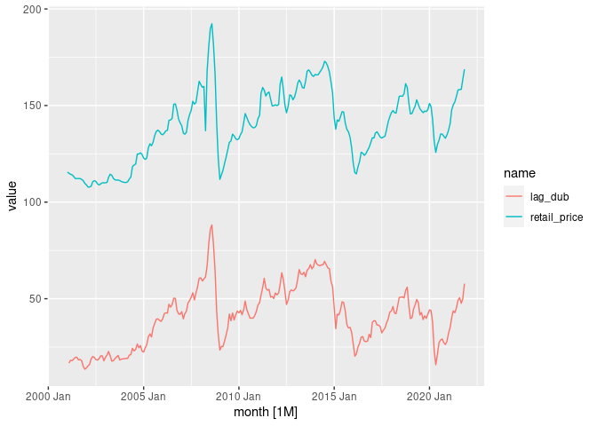

Gasoline prices in Japan
================
Mitsuo Shiota
2021-11-17

-   [Summary](#summary)
-   [Get gasoline prices](#get-gasoline-prices)
-   [Plot retail, wholesale gas and crude oil
    prices](#plot-retail-wholesale-gas-and-crude-oil-prices)
-   [Plot price differences](#plot-price-differences)
-   [Dubai crude oil price](#dubai-crude-oil-price)

Updated: 2022-03-11

## Summary

[Nikkei
reported](https://www.nikkei.com/article/DGXZQOUA169350W1A111C2000000/)
on November 17, 2021 that Ministry of Economy, Trade and Industry (METI)
is considering a subsidy to gasoline wholesalers to suppress gasoline
retail prices when they rise to higher than 170 yen per litre. At the
end of the article, Nikkei showed a skeptical view saying, “As the
number of retailers has decreased, the retailers may not reduce retail
prices even if wholesale prices fall.” So I study the relationship among
retail and wholesale prices of gasoline and imported crude oil prices in
Japan.

I find the current surge in retail prices of gasoline is mainly due to
the surge in imported crude oil prices, and partly due to the reduced
competition among retailers and wholesalers, who are getting more
margins.

To give a subsidy to wholesalers may incentivize them to raise their
margins even more. This subsidy idea is contrary to that of the Biden
Administration, which has begun to investigate oil companies.

## Get gasoline prices

Agency for National Resources Energy under METI publishes gasoline
prices in its [web
site](https://www.enecho.meti.go.jp/statistics/petroleum_and_lpgas/pl007/results.html#headline1).
Although the original retail price data include consumption tax since
April 1, 2004, I exclude consumption tax all over the period.

I get imported crude oil price data from customs statistics via
[e-Stat](https://www.e-stat.go.jp/stat-search/files?page=1&layout=datalist&toukei=00350300&bunya_l=16&tstat=000001013141&cycle=1&tclass1=000001013192&tclass2=000001013194&tclass3val=0).

## Plot retail, wholesale gas and crude oil prices

Yes, both retail and wholesale prices are rising, mainly due to rising
imported crude oil prices.

<!-- -->

## Plot price differences

Differences between retail and wholesale prices have been increasing
since 2016. The average difference was 12 yen per litre from 2000 Jul to
2015 Dec, and is 18 in 2022 Jan. This may reflect the reduced
competition among retailers. You can see the number of retailers has
constantly decreased since around 1995 in the last page of [this
material
(Japanese)](https://www.enecho.meti.go.jp/category/resources_and_fuel/distribution/hinnkakuhou/data/2021_07_30_01.pdf)
from Agency for National Resources Energy.

<!-- -->

Differences between wholesale price and imported crude oil price plus
gasoline tax have also been increasing. The average difference was 16
yen per litre from 2001 Jan to 2014 Dec, and is 16 in 2021 Dec. This may
reflect the reduced competition among wholesalers, who have got
monopolistic power by consolidation.

<!-- -->

## Dubai crude oil price

``` r
library(tidyquant)
```

    ## Loading required package: PerformanceAnalytics

    ## Loading required package: xts

    ## Loading required package: zoo

    ## 
    ## Attaching package: 'zoo'

    ## The following object is masked from 'package:tsibble':
    ## 
    ##     index

    ## The following objects are masked from 'package:base':
    ## 
    ##     as.Date, as.Date.numeric

    ## 
    ## Attaching package: 'xts'

    ## The following objects are masked from 'package:dplyr':
    ## 
    ##     first, last

    ## 
    ## Attaching package: 'PerformanceAnalytics'

    ## The following object is masked from 'package:graphics':
    ## 
    ##     legend

    ## Loading required package: quantmod

    ## Loading required package: TTR

    ## Registered S3 method overwritten by 'quantmod':
    ##   method            from
    ##   as.zoo.data.frame zoo

    ## ══ Need to Learn tidyquant? ════════════════════════════════════════════════════
    ## Business Science offers a 1-hour course - Learning Lab #9: Performance Analysis & Portfolio Optimization with tidyquant!
    ## </> Learn more at: https://university.business-science.io/p/learning-labs-pro </>

    ## 
    ## Attaching package: 'tidyquant'

    ## The following object is masked from 'package:fable':
    ## 
    ##     VAR

``` r
dub_oil <- tq_get(c("POILDUBUSDM", "EXJPUS"), get = "economic.data", from = "1990-01-01")
```

    ## Registered S3 method overwritten by 'tune':
    ##   method                   from   
    ##   required_pkgs.model_spec parsnip

``` r
dub_oil_month <- dub_oil %>% 
  pivot_wider(names_from = symbol, values_from = price) %>% 
  mutate(dub_oil_price = POILDUBUSDM * EXJPUS / 158.99) %>% 
  select(date, dub_oil_price) %>% 
  mutate(month = yearmonth(date)) %>% 
  as_tsibble(index = month) %>% 
  select(-date)
```

Import prices pretty precisely follow Dubai crude oil spot prices of one
month ago.

``` r
dub_import <- dub_oil_month %>% 
  inner_join(import_price, by = "month") %>% 
  rename(import_price = crude_oil_price) %>% 
  filter(!is.na(dub_oil_price), !is.na(import_price))

dub_import %>% 
  pivot_longer(c(import_price, dub_oil_price)) %>% 
  autoplot(value)
```

<!-- -->

``` r
dub_import %>% 
  mutate(lag_dub = lag(dub_oil_price)) %>% 
  select(-dub_oil_price) %>% 
  pivot_longer(c(import_price, lag_dub)) %>% 
  autoplot(value)
```

    ## Warning: Removed 1 row(s) containing missing values (geom_path).

<!-- -->

``` r
p0 <- dub_import %>% 
  ggplot(aes(dub_oil_price, import_price)) +
  geom_point(alpha = 0.2) +
  coord_fixed()

p1 <- dub_import %>% 
  ggplot(aes(lag(dub_oil_price, 1), import_price)) +
  geom_point(alpha = 0.2) +
  coord_fixed()

p2 <- dub_import %>% 
  ggplot(aes(lag(dub_oil_price, 2), import_price)) +
  geom_point(alpha = 0.2) +
  coord_fixed()

p0 | p1 | p2
```

    ## Warning: Removed 1 rows containing missing values (geom_point).

    ## Warning: Removed 2 rows containing missing values (geom_point).

<!-- -->

``` r
length(dub_import$dub_oil_price)
```

    ## [1] 251

``` r
cor(dub_import$dub_oil_price, dub_import$import_price) # 0.967
```

    ## [1] 0.967359

``` r
cor(dub_import$dub_oil_price[-251], dub_import$import_price[-1]) # 0.997
```

    ## [1] 0.9973712

``` r
cor(dub_import$dub_oil_price[c(-250, -251)], dub_import$import_price[c(-1, -2)]) # 0.974
```

    ## [1] 0.9743748

EOL
