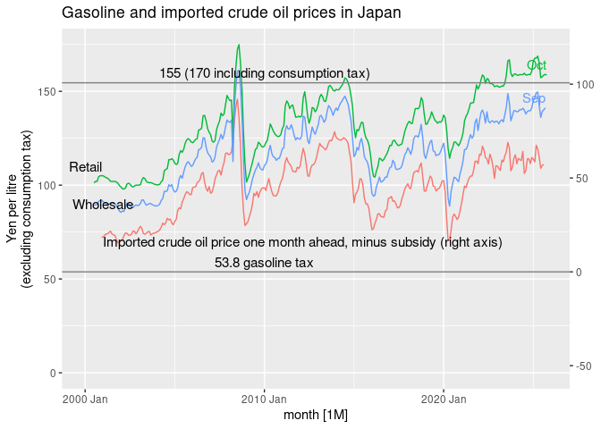
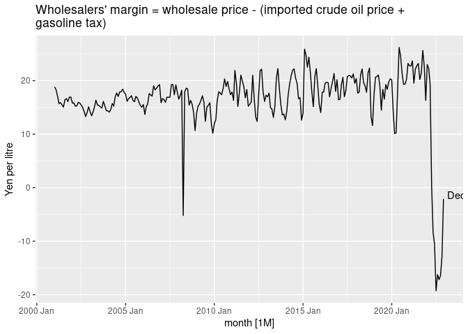
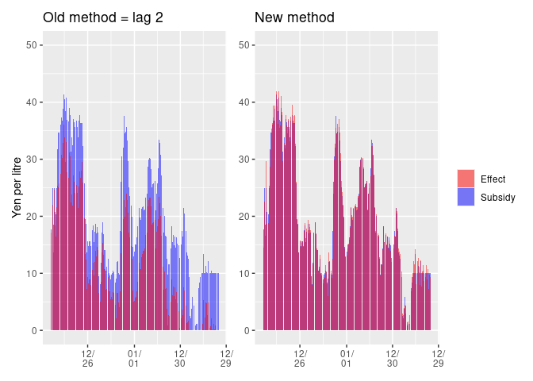
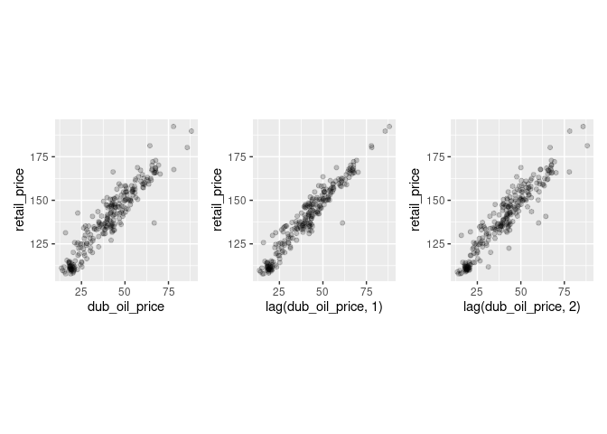
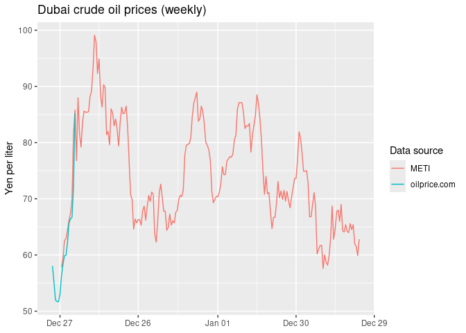
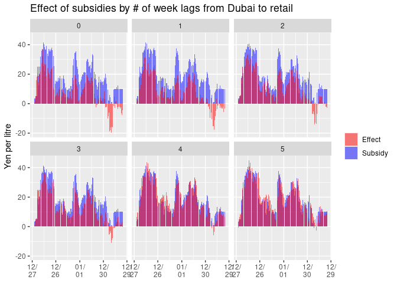

Gasoline prices in Japan
================
Mitsuo Shiota
2021-11-17

-   [Summary](#summary)
-   [Get gasoline prices](#get-gasoline-prices)
-   [Plot retail, wholesale gas and crude oil
    prices](#plot-retail-wholesale-gas-and-crude-oil-prices)
-   [Plot price differences](#plot-price-differences)
-   [Dubai crude oil price (monthly)](#dubai-crude-oil-price-monthly)
-   [Dubai crude oil price (weekly)](#dubai-crude-oil-price-weekly)

Updated: 2022-04-01

## Summary

[Nikkei
reported](https://www.nikkei.com/article/DGXZQOUA169350W1A111C2000000/)
on November 17, 2021 that Ministry of Economy, Trade and Industry (METI)
is considering a subsidy to gasoline wholesalers to suppress gasoline
retail prices when they rise to higher than 170 yen per litre. At the
end of the article, Nikkei showed a skeptical view saying, “As the
number of retailers has decreased, the retailers may not reduce retail
prices even if wholesale prices fall.” So I study the relationship among
retail and wholesale prices of gasoline and imported crude oil prices in
Japan.

I find the current surge in retail prices of gasoline is mainly due to
the surge in imported crude oil prices, and partly due to the reduced
competition among retailers and wholesalers, who are getting more
margins.

To give a subsidy to wholesalers may incentivize them to raise their
margins even more. This subsidy idea is contrary to that of the Biden
Administration, which has begun to investigate oil companies.

## Get gasoline prices

Agency for National Resources Energy under METI publishes gasoline
prices in its [web
site](https://www.enecho.meti.go.jp/statistics/petroleum_and_lpgas/pl007/results.html#headline1).
Although the original retail price data include consumption tax since
April 1, 2004, I exclude consumption tax all over the period.

I get imported crude oil price data from customs statistics via
[e-Stat](https://www.e-stat.go.jp/stat-search/files?page=1&layout=datalist&toukei=00350300&bunya_l=16&tstat=000001013141&cycle=1&tclass1=000001013192&tclass2=000001013194&tclass3val=0).

## Plot retail, wholesale gas and crude oil prices

Yes, both retail and wholesale prices are rising, mainly due to rising
imported crude oil prices.

<!-- -->

## Plot price differences

Differences between retail and wholesale prices have been increasing
since 2016. The average difference was 12 yen per litre from 2000 Jul to
2015 Dec, and is 18 in 2022 Jan. This may reflect the reduced
competition among retailers. You can see the number of retailers has
constantly decreased since around 1995 in the last page of [this
material
(Japanese)](https://www.enecho.meti.go.jp/category/resources_and_fuel/distribution/hinnkakuhou/data/2021_07_30_01.pdf)
from Agency for National Resources Energy.

<!-- -->

Differences between wholesale price and imported crude oil price plus
gasoline tax have also been increasing. The average difference was 16
yen per litre from 2001 Jan to 2014 Dec, and is 16 in 2021 Dec. This may
reflect the reduced competition among wholesalers, who have got
monopolistic power by consolidation.

<!-- -->

## Dubai crude oil price (monthly)

Import prices pretty precisely follow Dubai crude oil spot prices of one
month ago.

<!-- -->

    ## Warning: Removed 1 row(s) containing missing values (geom_path).

<!-- -->

    ## Warning: Removed 1 rows containing missing values (geom_point).

    ## Warning: Removed 2 rows containing missing values (geom_point).

<!-- -->

Correlations are 0.9674 if 0 month lag from Dubai to Japan customs,
0.9974 if 1 month lag, and 0.9744 if 2 months lag.

<!-- -->

    ## Warning: Removed 1 row(s) containing missing values (geom_path).

<!-- -->

    ## Warning: Removed 1 rows containing missing values (geom_point).

    ## Warning: Removed 2 rows containing missing values (geom_point).

<!-- -->

Retail prices (including constant 10 percent consumption tax) also
follow Dubai crude oil prices of one month ago. Correlations are 0.9393
if 0 month lag from Dubai to Japan customs, 0.9642 if 1 month lag, and
0.9406 if 2 months lag.

<!-- -->

The most recent difference between retail price (including constant 10
percenttax) and one month ago Dubai crude oil price is 110.99 at 2021
Nov

## Dubai crude oil price (weekly)

I get daily data from
[oilprice.com](https://oilprice.com/jp/%E5%8E%9F%E6%B2%B9%E4%BE%A1%E6%A0%BC%E3%83%81%E3%83%A3%E3%83%BC%E3%83%88).

[METI publishes](https://nenryo-gekihenkanwa.jp/pdf/result_rev8.pdf)
Dubai crude oil prices, counterfactual gasoline prices without
subsidies, actual gasoline prieces and effects of subsidies, which are
differences between counterfacual and actual, all in the units of yen /
litre every week.

Weekly prices are not so different between oilprice.com and METI.

<!-- -->

So I create weekly prices data by combining oilprice.com in 2021 and
METI in 2022.

METI calculates subsidy effects on retail prices by assuming that retail
prices will reflect subsidies 2 weeks later.

METI also assumes that there is 2 weeks lag between Dubai crude oil
prices and retail prices. If we assume 3 weeks lag instead, subsidy
effects are smaller. When effects are smaller than subsidies, subsidies
are not fully reflected in retail prices, and wholesalers and/or
retailers are getting benefits from subsidies.

<!-- -->

    ## Warning: Removed 1 rows containing missing values (geom_col).

<!-- -->

Above calculation assumes there is a constant margin between Dubai crude
oil prices and retail prices. Lag 0 to 5 assumes margins 107.3, 107.6,
110.8, 112.4, 118.5, 118.5 respectively.

Lag 2 assumes 110.8, and it is close to the most recent monthly margin
110.99 at 2021 Nov. Let us assume this margin over all lags between
Dubai crude oil prices and retail prices.

<!-- -->

    ## Warning: Removed 1 rows containing missing values (geom_col).

<!-- -->

As I assume fixed margin based on lag 2 assumption, lag 2 does not
change from the previous plots. In lags 3 to 5, there are less effects
of subsidies than the previous plots.

From this analysis, it is clear that the assumption on lag and normal
margin between Dubai crude oil prices and retail gasoline prices is very
important to calculate the effects by subsidies. METI assumes lag 2
weeks and normal margin 110.8 yen per litre. I hope I will find out
whether METI’s assumption is reasonable or not, while I update this
page.

EOL
