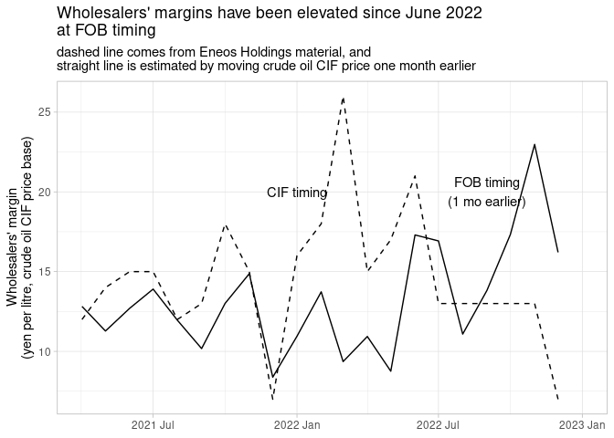

Wholesalers margin estimated from Eneos Holdings material
================
Mitsuo Shiota
2023-02-10

- <a href="#get-crude-oil-cif-price-from-customs-data"
  id="toc-get-crude-oil-cif-price-from-customs-data">Get crude oil CIF
  price from customs data</a>
- <a href="#margin-data-from-eneos-holdings"
  id="toc-margin-data-from-eneos-holdings">Margin data from Eneos
  Holdings</a>
- <a href="#dubai-crude-oil-price-data-from-meti"
  id="toc-dubai-crude-oil-price-data-from-meti">Dubai crude oil price data
  from METI</a>
- <a href="#estimate-average-difference-between-cif-and-fob"
  id="toc-estimate-average-difference-between-cif-and-fob">Estimate
  average difference between CIF and FOB</a>
- <a href="#estimate-cif-price-in-january-2023"
  id="toc-estimate-cif-price-in-january-2023">Estimate CIF price in
  January 2023</a>
- <a href="#chart-of-margin-at-cif-timing-and-fob-timing"
  id="toc-chart-of-margin-at-cif-timing-and-fob-timing">Chart of margin at
  CIF timing and FOB timing</a>

## Get crude oil CIF price from customs data

``` r
get_crude_oil_price <- function(df) {
  df %>% 
    mutate(Commodity =  str_remove_all(Commodity, "'| ")) %>% 
    filter(Commodity == "30301") %>% 
    pivot_longer(!("Exp or Imp":Unit), names_to = c(".value", "month"),
                 names_pattern = "^(\\w+)\\-(\\w+)$") %>% 
    filter(month != "Year") %>% 
    mutate(
      month = if_else(month == "Apl", "Apr", month),
      date = dmy(paste(1, month, Year)),
      crude_oil_price = Value / Quantity
    ) %>% 
    select(date, crude_oil_price)
}

import <- paste0("data/", dir("data/", ".csv")) %>% 
  map(~ read_csv(.x) %>% get_crude_oil_price) %>% 
  bind_rows() %>% 
  filter(!is.na(crude_oil_price))
```

## Margin data from Eneos Holdings

p14 of the material published on February 10, 2023.
<https://ssl4.eir-parts.net/doc/5020/ir_material_for_fiscal_ym/129709/00.pdf>

``` r
import <- import |> 
  rename(price_cif = crude_oil_price)

import_margin <- import |> 
  filter(date >= "2021-04-01") |> 
  bind_cols(
    # read manually from Eneos material
    tibble(
      margin_cif = c(12, 14, 15,
                       15, 12, 13,
                       18, 15, 7,
                       16, 18, 26,
                       15, 17, 21,
                       13, 13, 13,
                       13, 13, 7)
    )
  ) |> 
  bind_rows(import |> filter(date < "2021-04-01")) |> 
  arrange(date) |> 
  mutate(date = yearmonth(date))
```

## Dubai crude oil price data from METI

<https://nenryo-gekihenkanwa.jp/pdf/result_rev51.pdf>

``` r
meti_dubai_weekly <- tribble(
  ~start_date, ~price,
  "2022-01-03", 57.8,
  "2022-01-10", 59.4,
  "2022-01-17", 62.6,
  "2022-01-24", 62.9,
  "2022-01-31", 64.4,
  "2022-02-07", 66.2,
  "2022-02-14", 67.4,
  "2022-02-22", 69.9,
  "2022-03-01", 81.6,
  "2022-03-08", 85.8,
  "2022-03-15", 76.8,
  "2022-03-22", 88,
  "2022-03-29", 81.6,
  "2022-04-05", 79.2,
  "2022-04-12", 83.6,
  "2022-04-19", 85.6,
  "2022-04-26", 85.4,
  "2022-05-03", NA,
  "2022-05-10", 85.5,
  "2022-05-17", 88.2,
  "2022-05-24", 89.2,
  "2022-05-31", 93.3,
  "2022-06-07", 99.1,
  "2022-06-14", 97.9,
  "2022-06-21", 92.3,
  "2022-06-28", 94.9,
  "2022-07-05", 88.3,
  "2022-07-12", 86.3,
  "2022-07-19", 90.3,
  "2022-07-26", 89.8,
  "2022-08-02", 81.4,
  "2022-08-09", 82.0,
  "2022-08-16", 79.6,
  "2022-08-23", 86.0,
  "2022-08-30", 85.3,
  "2022-09-06", 83.0,
  "2022-09-13", 84.2,
  "2022-09-20", 82.4,
  "2022-09-27", 79.4,
  "2022-10-04", 83.5,
  "2022-10-11", 86.3,
  "2022-10-18", 85.1,
  "2022-10-25", 85.3,
  "2022-11-01", 86.5,
  "2022-11-08", 82.7,
  "2022-11-15", 76.5,
  "2022-11-22", 70.7,
  "2022-11-29", 69.8,
  "2022-12-06", 64.6,
  "2022-12-13", 66.4,
  "2022-12-20", 65.7,
"2022-12-27", 66.3,
"2023-01-03", NA,
"2023-01-10", 65.3,
"2023-01-17", 67.9,
"2023-01-24", 68.7,
"2023-01-31", 66.2
) |> 
  fill(price, .direction = "down")

meti_dubai_monthly <- meti_dubai_weekly |> 
  filter(start_date > "2022-04-01") |> 
  mutate(date = yearmonth(start_date)) |> 
  group_by(date) |> 
  summarize(price_fob = mean(price))

import_margin |> 
  full_join(meti_dubai_monthly, by = "date") |>
  filter(date >= yearmonth("2022-01")) |> 
  ggplot(aes(date, price_cif)) +
  geom_line(lty = 2) +
  geom_line(aes(y = lag(price_fob))) +
  annotate("text", x = yearmonth("2022-06"), y = 80, label = "Dubai price\nfrom METI material") +
annotate("text", x = yearmonth("2022-04"), y = 95, label = "CIF price\nfrom Japan Customs") +labs(x = NULL, y = "yen per litre",
       title = "Crude oil price")
```

    ## Warning: Removed 1 row containing missing values (`geom_line()`).

    ## Warning: Removed 4 rows containing missing values (`geom_line()`).

<!-- -->

## Estimate average difference between CIF and FOB

Calculate mean difference between CIF customs price and one month later
Dubai crude oil price.

``` r
cif_mean <- import_margin |> 
  filter(date >= yearmonth("2022-05")) |> 
  pull(price_cif) |> 
  mean()

fob_mean <- meti_dubai_monthly |> 
  filter(date >= yearmonth("2022-04")) |> 
  pull(price_fob) |> 
  mean()

cif_fob_diff <- cif_mean - fob_mean # 11.8
```

## Estimate CIF price in January 2023

``` r
import_margin2 <- import_margin |> 
  full_join(meti_dubai_monthly, by = "date") |> 
  mutate(
    price_cif = if_else(is.na(price_cif),
                             lag(price_fob) + cif_fob_diff,
                             price_cif),
    sales_price = price_cif + margin_cif,
    margin_fob = sales_price - lead(price_cif)
    )
```

## Chart of margin at CIF timing and FOB timing

Subsidy assumes FOB timing.

``` r
import_margin2 |> 
  filter(date >= yearmonth("2021-04")) |> 
  ggplot(aes(date, margin_fob)) +
  geom_line() +
  geom_line(aes(y = margin_cif), lty = 2) +
  annotate("text", x = yearmonth("2022-01"), y = 20, label = "CIF timing") +
  annotate("text", x = yearmonth("2022-09"), y = 20, label = "FOB timing\n(1 mo earlier)") +
  labs(x = NULL, y = "Wholesalers' margin\n(yen per litre, crude oil CIF price base)",
       title = "Wholesalers' margins have been elevated since June 2022\nat FOB timing",
       subtitle = "dashed line comes from Eneos Holdings material, and \nstraight line is estimated by moving crude oil CIF price one month earlier")
```

    ## Warning: Removed 1 row containing missing values (`geom_line()`).
    ## Removed 1 row containing missing values (`geom_line()`).

<!-- -->

EOL
